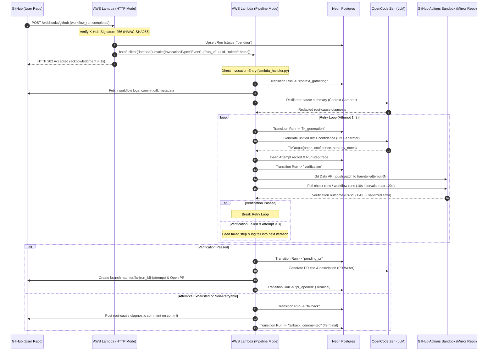
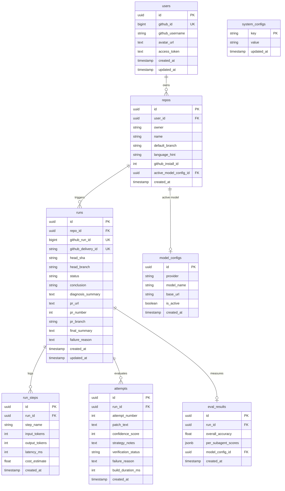

# HAUNTER — Architectural & Mechanical Specification

**System Classification:** Autonomous CI Failure Diagnosis & Remediation Engine  
**Author / Engineering Lead:** MD Sufiyan Bari  
**Runtime Target:** AWS Lambda (`x86_64`) + Neon Serverless Postgres + Cloudflare Workers (Static SPA)  
**Verification Engine:** Pure Git Data API + GitHub Actions Sandbox Runner  
**Document Purpose:** Exhaustive architectural reference, system specification, and ground-truth technical bible.

---

## 1. System Purpose & Core Boundaries

Haunter is an autonomous serverless system designed to intercept GitHub Actions CI workflow failures, isolate failure context, generate candidate patches, verify patches within a sterile GitHub Actions sandbox mirror, and open pull requests with full mechanical diagnostic traces.

```
       [ Upstream User Repository ]
                     │
         workflow_run (failure)
                     ▼
       [ AWS Lambda Function URL ]  ──► Returns HTTP 202 in <1s
                     │ (async self-invoke)
                     ▼
          [ FastAPI Orchestrator ]
         ┌───────────┴───────────┐
         ▼                       ▼
   [ Subagents ]        [ Neon Postgres ]
  • Context Gatherer     (State, traces,
  • Fix Generator         evals, configs)
  • Sandbox Verifier             │
  • PR Writer                    ▼
         │             [ Cloudflare Worker ]
         ▼             (Next.js 16.3.3 SPA)
  [ Target User Repo ]
  (PR opened OR diagnostic comment)
```

### 1.1 The Human Merge Gate Invariant
Haunter operates strictly as an autonomous contributor, never an autonomous administrator:
- **No Direct Push to Protected Branches:** The engine never pushes to `main`, `master`, `develop`, `release`, or any user-designated primary branch.
- **Pull Request Boundary:** Successful remediation paths culminate in an opened Pull Request against the default branch. The human engineer remains the sole merge authority.
- **Exhaustion Fallback Boundary:** If candidate patches fail verification across all allocated retry attempts (or if confidence falls below the acceptance threshold), Haunter aborts patch generation and posts a structured root-cause diagnostic comment to the failed commit. It never opens speculative, unverified, or broken PRs.

---

## 2. End-to-End Workflow & Execution Topology

### 2.1 Webhook Ingestion & Asynchronous Dispatch
GitHub enforces a strict 10-second acknowledgment window on webhook deliveries. Because a full diagnosis-fix-verification loop requires between 60 and 300 seconds, synchronous execution inside the webhook request handler is impossible.



### 2.2 Execution Step Breakdown
1. **Signature Verification:** Incoming `POST /webhooks/github` payloads are verified against `GITHUB_WEBHOOK_SECRET` using HMAC-SHA256 (`X-Hub-Signature-256`).
2. **Payload Filtering:** Webhooks are filtered to `action == "completed"` and `workflow_run.conclusion == "failure"`. Successful or pending runs are acknowledged with HTTP 200 and discarded.
3. **Idempotency Check:** Webhooks check for existing runs keyed on `github_run_id` and `github_delivery_id`. Re-deliveries are safely deduped.
4. **Asynchronous Self-Invocation:** Lambda HTTP handler executes `AWSHostingAdapter.schedule_pipeline()`, calling `boto3.client("lambda").invoke(FunctionName=self, InvocationType="Event", Payload={"run_id": str(run.id), "token": hmac_token})`. The HTTP request returns `202 Accepted` immediately.
5. **Worker Execution:** Lambda spins up a background invocation executing `lambda_handler.py:handler` in pipeline mode. The payload token is verified via constant-time HMAC comparison before `handle_failed_run(run_id)` runs.

---

## 3. Orchestrator Engine & State Machine

The orchestrator (`backend/app/orchestrator.py`) enforces a forward-only, deterministic state machine over `RunStatus`. Skipping states or reverting backwards triggers an immediate `InvalidTransitionError`.

```
                    ┌──────────────┐
                    │   pending    │
                    └──────┬───────┘
                           │
                           ▼
                ┌──────────────────────┐
                │  context_gathering   │
                └──────────┬───────────┘
                           │
                           ▼
                ┌──────────────────────┐
                │    fix_generation    │◄───────────┐
                └──────────┬───────────┘            │
                           │                        │ (retry attempt < 3)
                           ▼                        │
                ┌──────────────────────┐            │
                │     verification     │────────────┘
                └────┬────────────┬────┘
      (pass)         │            │ (fail / exhausted / low confidence)
   ┌─────────────────┘            └─────────────────┐
   ▼                                                ▼
┌──────────────┐                             ┌──────────────┐
│  pending_pr  │                             │   fallback   │
└──────┬───────┘                             └──────┬───────┘
       │                                            │
       ▼                                            ▼
┌──────────────┐                             ┌──────────────────────┐
│  pr_opened   │                             │  fallback_commented  │
│  (terminal)  │                             │      (terminal)      │
└──────────────┘                             └──────────────────────┘
       ▲                                            ▲
       └────────────────────┬───────────────────────┘
                            │ (on unhandled error)
                     ┌──────────────┐
                     │    error     │
                     │  (terminal)  │
                     └──────────────┘
```

### 3.1 State Definitions (`RunStatus`)
- `pending`: Run initialized from webhook delivery, queued for background processing.
- `context_gathering`: Distilling failure logs, commit diffs, and repository metadata via Context Gatherer.
- `fix_generation`: Generating candidate unified diff patch and calibrated confidence score via Fix Generator.
- `verification`: Executing test suite against candidate patch inside the isolated GitHub Actions test mirror.
- `pending_pr`: Generating pull request title and body via PR Writer following verified sandbox success.
- `fallback`: Generating and posting diagnostic commit comment following attempt exhaustion or low confidence.
- `pr_opened` *(Terminal)*: PR successfully opened on user's repository.
- `fallback_commented` *(Terminal)*: Diagnostic comment successfully published on commit.
- `completed` *(Terminal)*: Legacy terminal status maintained for schema compatibility.
- `error` *(Terminal)*: Run aborted due to unrecoverable system exception or timeout. Reachable from any non-terminal status.

### 3.2 Transition Invariants
```python
_ALLOWED_TRANSITIONS: dict[RunStatus, set[RunStatus]] = {
    RunStatus.pending:            {RunStatus.context_gathering, RunStatus.error},
    RunStatus.context_gathering:  {RunStatus.fix_generation, RunStatus.error},
    RunStatus.fix_generation:     {RunStatus.verification, RunStatus.fallback, RunStatus.error},
    RunStatus.verification:       {RunStatus.pending_pr, RunStatus.fallback, RunStatus.fix_generation, RunStatus.error},
    RunStatus.pending_pr:         {RunStatus.pr_opened, RunStatus.error},
    RunStatus.fallback:           {RunStatus.fallback_commented, RunStatus.error},
    RunStatus.pr_opened:          set(),
    RunStatus.fallback_commented: set(),
    RunStatus.completed:          set(),
    RunStatus.error:              set(),
}
```

### 3.3 Engine Parameters & Failure Safeguards
- **Wall-Clock Timeout:** `ORCHESTRATOR_TIMEOUT_S = 800.0` seconds. Enforces a hard cancellation barrier leaving 100 seconds of headroom below AWS Lambda's 900-second execution envelope.
- **Failure Reason Truncation:** `_FAILURE_REASON_MAX_CHARS = 10_000_000` for full error trace persistence without truncating deep stack traces in development.
- **Fast-Fail Repeated-Failure Heuristic:** Compares the trailing `_FAILURE_REASON_TAIL_CHARS = 200` characters of the verification failure output against the previous attempt. If identical, the engine detects that the LLM is stuck in an identical failure loop, aborts further attempts, and immediately fast-fails to `fallback`.
- **In-Memory Context Compaction:** The orchestrator maintains only a lightweight state dictionary: `{run_id, repo_id, step, decisions, confidence}`. Raw logs, raw diffs, and large JSON payloads pass through subagents and are immediately discarded.

---

## 4. Subagent Pipeline Specifications

Haunter divides cognitive responsibility among four isolated subagent stages.

```
┌────────────────────────────────────────────────────────────────────────┐
│                          FastAPI Orchestrator                          │
└───────┬────────────────────┬───────────────────┬───────────────────┬───┘
        │                    │                   │                   │
        │ 1. Raw Data        │ 2. Distilled Context │ 3. Patch Text     │ 4. Verified Patch
        ▼                    ▼                   ▼                   ▼
┌──────────────────┐ ┌──────────────────┐ ┌──────────────────┐ ┌──────────────────┐
│ Context Gatherer │ │  Fix Generator   │ │ Sandbox Verifier │ │    PR Writer     │
│                  │ │                  │ │ (GitHub Actions) │ │                  │
│ • Secret Scrubber│ │ • Strict Pydantic│ │ • Mirror Seed    │ │ • Branch Guard   │
│ • Log Parser     │ │ • Path Guard     │ │ • Workflows Push │ │ • Markdown Sanit │
│ • Distiller LLM  │ │ • Attempt Cap    │ │ • Status Poll    │ │ • GitHub API PR  │
└──────────────────┘ └──────────────────┘ └──────────────────┘ └──────────────────┘
```

### 4.1 Stage 1: Context Gatherer (`backend/app/subagents/context_gatherer.py`)
- **Inputs:** Raw workflow run failure logs, commit diff, commit metadata retrieved concurrently via GitHub REST API.
- **Secret Redaction:** Input streams are scanned against `_SECRET_PATTERNS` prior to LLM submission:
  - Multiline PEM private keys (RSA, EC, DSA, OpenSSH).
  - AWS Access Key IDs (`AKIA...`) and Secret Keys.
  - GitHub personal access tokens (`ghp_...`, `gho_...`, `github_pat_...`).
  - Generic Bearer tokens, private tokens, and high-entropy API key assignments.
- **Truncation Boundary:** Log content is capped at `CAP_CHARS = 10_000_000`.
- **Network Guards:** All GitHub fetches run inside `asyncio.wait_for(timeout=120.0)`.
- **Execution & Retry Contract:** Invokes LLM in plain prose mode. If the model emits empty content or bare markdown fences, the subagent triggers a single empty-response retry with a tightened prompt.
- **Output:** Concise 3-5 line root-cause summary (error type, affected file and line number, failure trigger). Persists telemetry in `run_steps` with `input_tokens`, `output_tokens`, `latency_ms`, and `cost_estimate`.

### 4.2 Stage 2: Fix Generator (`backend/app/subagents/fix_generator.py`)
- **Inputs:** Distilled root-cause summary, repository file tree hints, and prior attempt context (failed patch and sanitized test failure logs) if on retry.
- **Strict Pydantic Contract:** Calls LLM in structured JSON mode:
  ```python
  class FixOutput(BaseModel):
      model_config = ConfigDict(strict=True)
      patch: str = Field(default="")
      confidence: int = Field(ge=0, le=100)
      strategy_notes: Optional[str] = Field(default=None, max_length=500)
  ```
- **Security & Path Traversal Guards:** Generated diffs are parsed and validated:
  - File paths must be valid relative POSIX paths (`PurePosixPath`).
  - Paths with parent directory traversals (`..`) or absolute roots are rejected (`PatchRejected`).
  - Paths starting with `_BLOCKED_PATH_PREFIXES = (".git/", ".github/workflows/")` are rejected to prevent workflow compromise or git metadata tampering.
- **Confidence Gate:** If `confidence < LOW_CONFIDENCE_THRESHOLD (30)` or `patch == ""`, the subagent raises `LowConfidenceSkip`. The orchestrator treats this as a clean soft failure and routes immediately to `fallback`.
- **Concurrency & Attempt Cap:** Enforces `settings.max_attempts` (default 3) via database-level checks.

### 4.3 Stage 3: Sandbox Verifier (`backend/app/sandbox/github_actions_runner.py`)
- Dispatches candidate patches to an isolated test mirror repository, pushes workflows, and polls execution. Fully detailed in §5.

### 4.4 Stage 4: PR Writer (`backend/app/subagents/pr_writer.py`)
- **Inputs:** Verified patch text, root-cause diagnosis summary, repository metadata.
- **Server-Side Branch Derivation:** Branch names are strictly generated server-side:
  ```python
  branch = f"haunter/fix-{run.id.hex[:8]}-{attempt.attempt_number}"
  ```
  Verified against `^[a-zA-Z0-9/_\-\.]+$` and checked against protected branch names (`main`, `master`, `develop`, etc.).
- **Strict Schema:** Validates LLM output with `PROutput(title: 5..72 chars, body: 20..10000000 chars)`.
- **Output:** Creates branch via Git Data API, commits verified patch, opens PR via `POST /repos/{owner}/{repo}/pulls`, and records `pr_url`, `pr_number`, and `pr_branch` on `Run`.

### 4.5 Fallback Path: Diagnosis-Only Comment
- Triggered when:
  1. All verification attempts (1..3) fail.
  2. Fix Generator signals `LowConfidenceSkip`.
  3. Non-retryable sandbox error occurs (permissions, quota, missing App installation).
- Calls `app.github_client.post_commit_comment` via `POST /repos/{owner}/{repo}/commits/{sha}/comments`.
- Posts structured markdown containing:
  - Distilled root cause from Context Gatherer.
  - Number of remediation attempts evaluated.
  - Table of attempted strategies with respective failure reasons.
  - Explicit notification that no files were modified and no PR was opened.
- Transitions run state to `fallback_commented`.

---

## 5. Sandbox Verification Engine: GitHub Actions Deep Dive

Haunter employs a dedicated, serverless sandbox verification engine based entirely on GitHub Actions CI and the GitHub Git Data API (`backend/app/sandbox/github_actions_runner.py`).

```
┌────────────────────────────────────────────────────────────────────────┐
│                 GitHub Actions Sandbox Architecture                    │
└────────────────────────────────────────────────────────────────────────┘
                                 │
     1. Retrieve App Private Key │ AWS SSM Parameter Store
                                 ▼ (/haunter/GITHUB_SANDBOX_APP_PRIVATE_KEY)
                  ┌──────────────────────────────┐
                  │ Mint Short-Lived App Token   │ (TTL: 55 min cache)
                  └──────────────┬───────────────┘
                                 │
     2. Seed Mirror Repo         │ GET /repos/{user_repo}/tarball/{head_sha}
                                 ▼ (_seed_tarball.py)
                  ┌──────────────────────────────┐
                  │  Deterministic Test Mirror   │ (kaiizer777/haunter-test-{hash})
                  │  • Priority Unpack (Tier 0-3)│
                  │  • Batch Blobs (16 parallel) │
                  │  • Tree -> Commit -> Ref     │
                  └──────────────┬───────────────┘
                                 │
     3. Inject CI Workflow       │ detect_language() -> haunter-test-{py,ts}.yml
                                 ▼ (Committed to .github/workflows/ via PAT)
                  ┌──────────────────────────────┐
                  │ Prepare Verification Branch  │
                  │ Branch: haunter-attempt-{N}  │
                  │ Patch: Git Data API Commit   │
                  └──────────────┬───────────────┘
                                 │
     4. Execution Trigger        │ on: push [ haunter-attempt-* ]
                                 ▼ (GitHub Actions Hosted Runner)
                  ┌──────────────────────────────┐
                  │  Unidirectional Polling Loop │
                  │  • Check Runs API (every 10s)│
                  │  • Sanitized Failure Extract │
                  │  • Max Duration: 120s        │
                  └──────────────────────────────┘
```

### 5.1 Credential Lifecycle & Authentication
- **Private Key Storage:** The GitHub App private key PEM resides in AWS Systems Manager (SSM) Parameter Store at `/haunter/GITHUB_SANDBOX_APP_PRIVATE_KEY`.
- **In-Process Caching:** Loaded lazily on first token mint into memory cache `_PEM_CACHE`.
- **JWT Minting:** Generates RS256-signed JWTs with a 10-minute validity window and 30-second backdate to absorb clock drift.
- **Installation Token Cache:** GitHub App installation tokens are minted via `POST /app/installations/{installation_id}/access_tokens` and cached in `_TOKEN_CACHE` with a 5-minute pre-expiry margin (55 minutes effective TTL).

### 5.2 Deterministic Test Mirror Isolation
- **Namespace Strategy:** Isolated test mirrors are created under the configured sandbox organization or primary account `kaiizer777`.
- **Deterministic Naming:** Repositories are mapped per user to ensure tenant isolation:
  $$\text{hash} = \text{SHA256}(\text{user\_github\_id} + \text{":haunter-sandbox-v1"})[0:8]$$
  $$\text{repo\_name} = \text{"haunter-test-" + hash}$$
- **Lifecycle:** Created once via `POST /orgs/{org}/repos` (or `/user/repos`) with `private: true`, `auto_init: true`. Subsequent runs reuse the existing mirror idempotently.

### 5.3 Tarball Seeding Algorithm (`backend/app/sandbox/_seed_tarball.py`)
To prevent cross-repository commit tree corruption (HTTP 422 errors), Haunter seeds test mirrors directly from the user repository's code:
1. **Fetch Archive:** Downloads repository archive at `run.head_sha` via `GET /repos/{user_repo}/tarball/{sha}` using header `Accept: application/vnd.github.tarball`. Falls back to PAT authentication if App token yields 403.
2. **Safety Caps:**
   - `MAX_TARBALL_BYTES = 100 * 1024 * 1024` (100 MB max archive size).
   - `MAX_FILE_BYTES = 5 * 1024 * 1024` (5 MB max individual file size).
3. **Extraction & Filtering:**
   - Strips GitHub archive root directory prefix.
   - Discards directories and symlinks (prevents symlink-based traversal vulnerabilities).
   - Skips blacklisted prefixes: `.git/`, `.github/workflows/`.
4. **Priority Tier Sorting:** Files are sorted and selected according to architectural necessity before enforcing `seed_max_files` (default 500):
   - **Tier 0 (Test & Tooling Configs):** `pytest.ini`, `pyproject.toml`, `setup.cfg`, `setup.py`, `tox.ini`, `conftest.py`, `.python-version`.
   - **Tier 1 (Dependency Manifests):** `requirements*.txt`, `Pipfile`, `Pipfile.lock`, `poetry.lock`.
   - **Tier 2 (Test Source Files):** `tests/**`, `test/**`, `test_*.py`, `*_test.py`.
   - **Tier 3 (Application Source Code):** All other source files.
5. **Git Data API Population:**
   - Small text files (< 50,000 bytes) are inlined directly into the tree payload to minimize API calls and avoid secondary rate limits.
   - Remaining files are created as git blobs in parallel batches (`BLOB_BATCH_SIZE = 16`) with 0.5-second throttling pauses.
   - Constructs git tree, generates root commit, and updates default branch reference.

### 5.4 Workflow Deployment & Language Detection
The mirror inspects file extensions to detect repository runtime:
- **Python (`detect_language` -> `"py"`):** Deploys `haunter-test-py.yml`:
  - Runner: `ubuntu-latest`.
  - Python: 3.11.
  - Steps: Dependency installation, best-effort linting (`ruff`, `mypy`), test execution (`pytest -q`).
- **TypeScript / JavaScript (`detect_language` -> `"ts"`):** Deploys `haunter-test-ts.yml`:
  - Runner: `ubuntu-latest`.
  - Node.js: 20.
  - Steps: `npm ci` / `npm install`, compile check (`tsc --noEmit`), linting (`eslint`), test execution (`npm test`).
- **Template Delivery:** Pushed to `.github/workflows/` using PAT fallback token to bypass GitHub App token workflow scope restrictions.

### 5.5 Patch Application & Branch Isolation
1. Generates branch `haunter-attempt-{attempt_number}` pointing to the mirror's default branch commit.
2. Parses unified diff patch into individual file modifications. Enforces patch limits: $\le 20$ files, $\le 200 \text{ KB}$ total diff size.
3. Commits modified files atomically to `haunter-attempt-{attempt_number}` using Git Data API (blob -> tree -> commit -> ref update).
4. Pushing to `haunter-attempt-{attempt_number}` triggers the GitHub Actions workflow via `on: push: branches: ['haunter-attempt-*']`.

### 5.6 Unidirectional Polling & Failure Sanitization
- **Polling Loop:** Polls `GET /repos/{owner}/{repo}/actions/runs?head_sha={commit_sha}` every 10 seconds up to `github_sandbox_poll_timeout_seconds` (120 seconds).
- **Log Extraction:** On failure, retrieves job step logs via GitHub Actions Logs API.
- **Sanitization (`_sanitize_failure_reason`):** Strips environment variables, access tokens, credentials, and truncates logs.
- **Fast-Fail Classification:** Classifies errors matching non-retryable patterns (HTTP 403, billing/quota limit, installation revoked). Prefixes failure reason with `[non-retryable]`, signalling orchestrator to abort the retry loop and immediately route to fallback.

---

## 6. Database Schema & Data Models

Haunter utilizes **Neon Serverless Postgres** managed via SQLAlchemy 2.0 async and Alembic migrations.



### 6.1 Relational Schema Specifications (`backend/app/models.py`)

#### `users`
- `id`: `UUID` (Primary Key, default `uuid.uuid4`).
- `github_id`: `BigInteger` (Unique, non-nullable, indexed).
- `github_username`: `String(255)` (Non-nullable).
- `avatar_url`: `Text` (Nullable).
- `access_token`: `Text` (Nullable, encrypted at rest via Fernet).
- `created_at`: `TIMESTAMP(timezone=True)` (Default UTC now).
- `updated_at`: `TIMESTAMP(timezone=True)` (On-update UTC now).

#### `repos`
- `id`: `UUID` (Primary Key, default `uuid.uuid4`).
- `user_id`: `UUID` (Foreign Key `users.id` ondelete `CASCADE`, non-nullable, indexed).
- `owner`: `String(255)` (Non-nullable).
- `name`: `String(255)` (Non-nullable).
- `default_branch`: `String(255)` (Nullable).
- `language_hint`: `String(255)` (Nullable).
- `github_install_id`: `Integer` (Nullable).
- `active_model_config_id`: `UUID` (Foreign Key `model_configs.id` ondelete `SET NULL`, Nullable).
- `created_at`: `TIMESTAMP(timezone=True)`.
- *Constraints:* `UniqueConstraint("user_id", "owner", "name", name="uq_repo_user_owner_name")`.

#### `runs`
- `id`: `UUID` (Primary Key, default `uuid.uuid4`).
- `repo_id`: `UUID` (Foreign Key `repos.id` ondelete `CASCADE`, non-nullable, indexed).
- `github_run_id`: `BigInteger` (Unique, non-nullable, indexed).
- `github_delivery_id`: `String(255)` (Unique, nullable, indexed).
- `head_sha`: `String(40)` (Non-nullable).
- `head_branch`: `String(255)` (Non-nullable).
- `status`: `String(50)` (Non-nullable).
- `conclusion`: `String(50)` (Nullable).
- `diagnosis_summary`: `Text` (Nullable).
- `pr_url`: `Text` (Nullable).
- `pr_number`: `Integer` (Nullable).
- `pr_branch`: `String(255)` (Nullable).
- `final_summary`: `Text` (Nullable).
- `failure_reason`: `Text` (Nullable).
- `created_at`: `TIMESTAMP(timezone=True)`.
- `updated_at`: `TIMESTAMP(timezone=True)`.

#### `run_steps`
- `id`: `UUID` (Primary Key, default `uuid.uuid4`).
- `run_id`: `UUID` (Foreign Key `runs.id` ondelete `CASCADE`, non-nullable, indexed).
- `step_name`: `String(255)` (Non-nullable).
- `input_tokens`: `Integer` (Default 0).
- `output_tokens`: `Integer` (Default 0).
- `latency_ms`: `Integer` (Default 0).
- `cost_estimate`: `Float` (Default 0.0).
- `created_at`: `TIMESTAMP(timezone=True)`.

#### `attempts`
- `id`: `UUID` (Primary Key, default `uuid.uuid4`).
- `run_id`: `UUID` (Foreign Key `runs.id` ondelete `CASCADE`, non-nullable, indexed).
- `attempt_number`: `Integer` (Non-nullable).
- `patch_text`: `Text` (Non-nullable).
- `confidence_score`: `Integer` (Nullable, 0..100).
- `strategy_notes`: `Text` (Nullable).
- `verification_status`: `String(50)` (Nullable).
- `failure_reason`: `Text` (Nullable).
- `build_duration_ms`: `Integer` (Nullable).
- `created_at`: `TIMESTAMP(timezone=True)`.
- *Constraints:* `UniqueConstraint("run_id", "attempt_number", name="uq_attempt_run_number")`.

#### `model_configs`
- `id`: `UUID` (Primary Key, default `uuid.uuid4`).
- `provider`: `String(255)` (Non-nullable).
- `model_name`: `String(255)` (Default `"nemotron-3.5-lightning-free"`).
- `base_url`: `String(255)` (Default `"https://opencode.ai/zen/v1"`).
- `is_active`: `Boolean` (Default `True`).
- `created_at`: `TIMESTAMP(timezone=True)`.

#### `eval_results`
- `id`: `UUID` (Primary Key, default `uuid.uuid4`).
- `run_id`: `UUID` (Foreign Key `runs.id` ondelete `SET NULL`, Unique, Nullable).
- `overall_accuracy`: `Float` (Nullable).
- `per_subagent_scores`: `JSONB` (Nullable).
- `model_config_id`: `UUID` (Foreign Key `model_configs.id` ondelete `SET NULL`, Nullable).
- `created_at`: `TIMESTAMP(timezone=True)`.

#### `system_configs`
- `key`: `String(255)` (Primary Key).
- `value`: `String(255)` (Non-nullable).
- `updated_at`: `TIMESTAMP(timezone=True)`.

### 6.2 Connection Pooling Architecture
Neon Postgres utilizes an external PgBouncer connection pooler (`*-pooler.postgres.neon.tech`). To prevent connection exhaustion and double-pooling conflicts:
- **Application Runtime (`async_session_maker`):** Connects to the pooled host via `asyncpg` using SQLAlchemy `NullPool`. Application processes do not manage client-side pools; PgBouncer multiplexes connections server-side.
- **Migration Engine (Alembic):** Connects directly to the unpooled endpoint (`DATABASE_URL_UNPOOLED`) to support transactional DDL statements and prepared statements unsupported by PgBouncer transaction pooling.

---

## 7. Security Architecture & Invariants

```
┌────────────────────────────────────────────────────────────────────────┐
│                          Security Boundaries                           │
├────────────────────────────────────────────────────────────────────────┤
│ Public Network                                                         │
│   │                                                                    │
│   ├──► Webhook: HMAC-SHA256 (X-Hub-Signature-256) Verified             │
│   │                                                                    │
│   ├──► Browser Session: Cookie haunter_session                         │
│   │    SameSite=None; Secure; HttpOnly; Signed (itsdangerous 14d)      │
│   │                                                                    │
│   └──► GitHub OAuth App: read:user scope only (No repo write access)   │
├────────────────────────────────────────────────────────────────────────┤
│ Lambda Execution Context                                               │
│   │                                                                    │
│   ├──► Token Storage: Fernet encrypted at rest (TOKEN_ENCRYPTION_KEY)  │
│   │                                                                    │
│   ├──► SSM Parameters: GITHUB_SANDBOX_APP_PRIVATE_KEY cached in memory │
│   │                                                                    │
│   └──► Internal Dispatch: HMAC-SHA256 authenticated self-invocation    │
├────────────────────────────────────────────────────────────────────────┤
│ Sandbox Execution Boundary                                             │
│   │                                                                    │
│   ├──► Diff Validation: Reject .git/, .github/, directory traversal    │
│   │                                                                    │
│   └──► Execution Mirror: Isolated repo, credential-sanitized logs      │
└────────────────────────────────────────────────────────────────────────┘
```

### 7.1 Cross-Origin Cookie Transmissions
The frontend SPA runs on Cloudflare Workers (`haunter-ci-agent.workers.dev` or custom domain) while the backend runs on AWS Lambda Function URL (`*.lambda-url.us-east-1.on.aws`). Because these exist on different effective top-level domains (eTLD+1), browser cross-site cookie policies apply:
- Cookie Name: `haunter_session`.
- Flags: `samesite="none"`, `secure=True`, `httponly=True`, `max_age=1209600` (14 days).
- Cryptographic Signature: Signed using `itsdangerous.TimestampSigner` with `SESSION_SECRET_KEY`.
- *Invariant:* `SameSite=Lax` is strictly prohibited as it prevents the browser from transmitting the session cookie in cross-origin fetch requests from the Cloudflare Worker domain to the Lambda Function URL.

### 7.2 GitHub Credential Segregation
1. **GitHub OAuth App:** Used solely for dashboard login via `/auth/login` and `/auth/callback`. Requests minimal scope `read:user`. Prevents account takeover or broad token leakage.
2. **GitHub App Installation:** Distinct application installed per organization or repository. Holds scoped permissions (`contents:write`, `pull_requests:write`, `checks:read`, `actions:read`).
3. **Encryption at Rest:** User OAuth access tokens are encrypted with AES-128-CBC / HMAC-SHA256 via Fernet (`app.auth._encrypt_token`) using `settings.token_encryption_key`. Plaintext tokens never touch the database.

### 7.3 Webhook HMAC Verification
Incoming webhook requests are validated against `settings.github_webhook_secret`:
$$\text{Signature} = \text{HMAC-SHA256}(\text{payload\_bytes}, \text{secret})$$
Compared in constant time via `hmac.compare_digest` against the `X-Hub-Signature-256` header. Requests failing verification return HTTP 401 and terminate immediately.

### 7.4 Pipeline Self-Invocation Authentication
Asynchronous self-invocations (`boto3.client("lambda").invoke(InvocationType="Event")`) bypass HTTP gateways. To prevent unauthorized direct invocations triggering arbitrary `run_id` processing:
- The adapter computes an HMAC token: $\text{HMAC-SHA256}(\text{run\_id}, \text{GITHUB\_WEBHOOK\_SECRET})$.
- Passed in the payload: `{"run_id": str(run.id), "token": token}`.
- `lambda_handler.py` verifies the token in constant time before executing the pipeline.

---

## 8. Serverless Infrastructure & Compute Topology

### 8.1 Backend: AWS Lambda Function URL
- **Hosting Adapter:** FastAPI wrapped with Mangum (`lifespan="off"`).
- **Architecture:** `x86_64` (Verified in `infra/aws/lambda.tf:159`, `backend/rebuild_lambda_zip.py:53`, and `aws.md:57`).
- **Memory:** 512 MB.
- **Execution Timeout:** 900 seconds (15 minutes).
- **Endpoint Protocol:** AWS Lambda Function URL (`auth_type = "NONE"`).
- **CORS Configuration:** Handled at FastAPI application layer (`CORSMiddleware`) with explicit `allow_origins=[settings.frontend_url]` and `allow_credentials=True`.
- **Packaging (`backend/rebuild_lambda_zip.py`):** Dependencies compiled using `--platform manylinux2014_x86_64 --only-binary=:all:` to ensure binary compatibility with the Amazon Linux Lambda environment.

### 8.2 Frontend: Cloudflare Workers Static Assets
- **Framework:** Next.js 16.3.3 Single Page Application (SPA).
- **Export Mode:** Static HTML/JS bundle (`output: "export"`, `images: { unoptimized: true }` in `frontend/next.config.ts`).
- **Deployment Platform:** Cloudflare Workers using Wrangler Static Assets (`frontend/wrangler.jsonc`).
- **Worker Configuration:**
  - Name: `haunter-ci-agent`.
  - Static Asset Directory: `./out`.
  - Not Found Handling: `404-page` (routes missing paths to SPA error handling).
  - Compatibility Date: `2025-09-01` (`nodejs_compat`).

### 8.3 Zero-Cost Operating Envelope
Haunter operates permanently within serverless free-tier envelopes:
- **Compute (AWS Lambda):** 1,000,000 requests/month and 400,000 GB-seconds/month permanently free.
- **Database (Neon Postgres):** 0.5 GB storage, serverless compute scaling to zero.
- **Hosting (Cloudflare Workers):** 100,000 requests/day permanently free.
- **CI Sandbox (GitHub Actions):** Unlimited runner minutes on public repositories.

---

## 9. Model Provider Layer & Dynamic Switcher

### 9.1 OpenCode Zen Integration
Haunter connects to OpenCode Zen as its default OpenAI-compatible LLM endpoint:
- **Base URL:** `https://opencode.ai/zen/v1`
- **Default Model:** `nemotron-3.5-lightning-free` (NVIDIA Nemotron 3.5 Lightning Free tier).
- **Context Window:** 1,000,000 tokens.
- **Client Implementation:** `backend/app/llm/client.py` wraps `httpx.AsyncClient` with custom exponential backoff, usage accounting, and latency measurement.

### 9.2 Hot-Switchable Architecture
LLM configurations are decoupled from application deployments:
1. **Model Switcher (`PUT /config/model`):**
   - Admin-gated endpoint updates active model selection globally or per-repository.
   - Stored in `model_configs` table and referenced by `repos.active_model_config_id`.
   - Dynamic model discovery (`GET /config/model/available`) queries available OpenCode Zen models in real time.
2. **System Config Store (`system_configs`):**
   - Stores runtime keys (`hosting_provider`, `sandbox_provider`).
   - Cached in-memory with a 60-second TTL (`_CACHE_TTL = 60.0`).
   - Updates via `PUT /config/hosting` immediately invalidate local process caches via `invalidate_provider_cache()`.

---

## 10. Evaluation Harness & Golden Test Bench

The evaluation harness (`backend/eval/`) provides regression testing across curated real-world failure cases without requiring live GitHub webhook triggers.

### 10.1 Golden Dataset Architecture (`backend/eval/fixtures/golden_cases.json`)
Consists of **20 curated golden failure fixtures** spanning standard failure classifications:
- **Import Errors:** Missing modules, circular imports, version mismatches (e.g. `chardet` missing in `psf/requests`).
- **Type Errors:** Argument typing mismatches, `NoneType` attribute errors (e.g. route handling in `pallets/flask`).
- **Assertion Errors:** Numerical precision drifts, array shape mismatches (e.g. dot product in `numpy/numpy`).
- **Syntax & Schema Errors:** Malformed payloads, invalid configuration schemas.

### 10.2 Evaluation Execution Modes
The runner (`python -m eval.runner`) supports dual execution profiles:
- `--dry-run`: Stubs LLM outputs and sandbox runs for deterministic local validation and CI testing.
- `--live`: Dispatches real requests to the active LLM provider (`OpenCode Zen`) while keeping sandbox runs simulated to prevent external side effects.

### 10.3 Scoring & Regression Detection (`backend/eval/compare.py`)
- **Context Gatherer Metric:** Keyword extraction score matching distilled diagnosis against `expected_root_cause_keywords`.
- **Fix Generator Metric:** Confidence score validity and patch safety verification against `expected_fix_characteristics`.
- **Regression Threshold:** `REGRESSION_THRESHOLD = 0.05` (5%).
- **Comparator:** Diffing two evaluation runs flags a regression if any subagent score drops by more than 5%. Persisted in `eval_results`.

---

## 11. Frontend Application Architecture

The dashboard is built with Next.js 16.3.3 and React 19, statically exported and deployed to Cloudflare Workers.

```
frontend/src/app/
├── layout.tsx             # Root layout with navigation bar and auth provider
├── page.tsx               # System overview, high-level metrics, active runs
├── login/page.tsx         # GitHub OAuth login screen
├── repos/page.tsx         # Repository management (connect, disconnect, configure)
├── runs/
│   ├── page.tsx           # Global runs feed (status, confidence, timings)
│   └── detail/page.tsx    # Single-run trace view (query param ?id={run_id})
├── eval/page.tsx          # Golden eval suite runner, history, and diff inspector
└── config/page.tsx        # LLM model switcher and hosting provider diagnostics
```

### 11.1 Client-Side State & Cross-Origin Auth
- **SPA Query Pattern:** Detail pages utilize query-parameter routing (`/runs/detail?id=...`) to maintain compatibility with static asset hosting (`output: "export"`).
- **Credentials Handling:** All API requests pass `credentials: "include"` via standard `fetch` or React hooks to transmit the `haunter_session` cookie across origins to the Lambda Function URL.
- **Observability Rendering:** The run detail view visualizes the complete execution timeline by polling `/runs/{id}/steps`, rendering individual subagent latency, token consumption, and cost estimates.

---

## 12. Historical Transitions & Architectural Decisions

### 12.1 Sandbox Architecture Evolution (Phase 17 Cleanup)
During early system design, Haunter planned multi-cloud sandbox runners across AWS CodeBuild, GCP Cloud Build, and Local Docker. In Phase 17, all legacy runners were officially retired in favor of the pure Git Data API + GitHub Actions sandbox runner:
- **AWS CodeBuild Retirement:** Deprecated due to account-level concurrent build limits (`AccountLimitExceededException` in `us-east-1`), slow cold starts (~45-90 seconds container provisioning), and complex VPC/IAM overhead.
- **GCP Cloud Build Retirement:** Dropped to eliminate secondary cloud dependencies, GCP IAM credential management, and the heavyweight `google-cloud-build` client library (saving ~30 MB in `lambda.zip`).
- **Local Docker Retirement:** Removed due to inability to run Docker-in-Docker within AWS Lambda's read-only serverless environment.
- **Pure GitHub Actions Selection:** Zero additional infrastructure cost, native parity with real CI environments, instant runner availability on public repositories, and zero external daemon dependencies.

### 12.2 Hosting Platform Evolution: Cloudflare Workers Static Assets
Originally targeted for Cloudflare Pages (`*.pages.dev`), the frontend hosting was migrated to **Cloudflare Workers Static Assets** (`frontend/wrangler.jsonc`) using worker `haunter-ci-agent`. This consolidates edge infrastructure onto Cloudflare's modern Workers platform with explicit asset directory routing (`./out`) and single-command Wrangler deployments.

### 12.3 Compute Architecture Alignment: x86_64
Early architecture drafts proposed ARM64 Graviton2 for Lambda. Ground truth verification confirmed and locked the architecture to **`x86_64`** (`infra/aws/lambda.tf:159`, `aws.md:57`). Cross-compiling Python packages with native extensions (such as `asyncpg` and `cryptography`) from Windows development hosts for Lambda requires standardizing on `--platform manylinux2014_x86_64`, which aligns with the x86_64 Lambda runtime.

### 12.4 Session Security Fix: SameSite=None
Original drafts specified `SameSite=Lax` for session cookies. In cross-origin topologies where the frontend is hosted on Cloudflare Workers and the API is hosted on AWS Lambda Function URL, modern browsers classify API requests as third-party cross-site contexts and refuse to send `SameSite=Lax` cookies. The architecture strictly mandates `samesite="none"` paired with `secure=True` and `httponly=True`.

---

## 13. Operational Playbook & Verification Criteria

### 13.1 Health Check Endpoints
- `GET /health`: Basic liveness check. Returns `{"status": "ok"}`.
- `GET /health/sandbox`: Validates sandbox provider configuration and active GitHub App installation.
  ```json
  {
    "provider": "github_actions",
    "ok": true,
    "detail": {
      "org": "kaiizer777",
      "app_id": "4772354",
      "installation_id": "157771121"
    }
  }
  ```

### 13.2 Deployment Verification Protocol
1. **Lambda Package Build:**
   ```powershell
   cd backend
   python rebuild_lambda_zip.py
   ```
   *Verification:* Ensure output `lambda.zip` is ~39–41 MB and includes `mangum`.
2. **Infrastructure Apply:**
   ```powershell
   cd ../infra/aws
   terraform plan
   terraform apply
   ```
3. **Database Migrations:**
   ```powershell
   cd ../backend
   alembic upgrade head
   ```
4. **Frontend Deployment:**
   ```powershell
   cd ../frontend
   npm run build
   npx wrangler deploy
   ```
